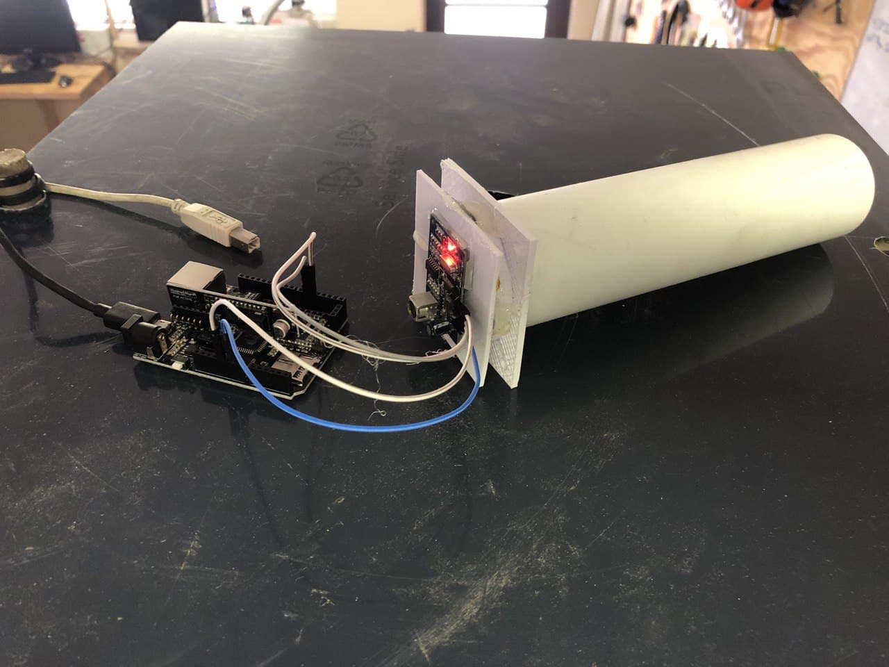
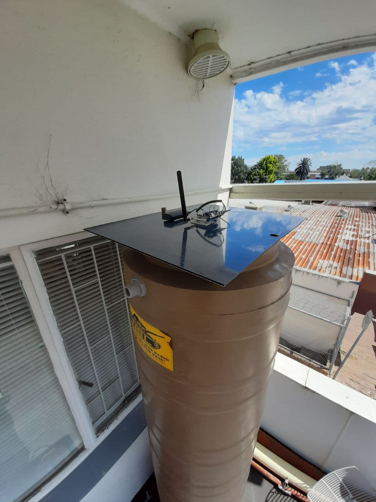

# LoraWan - Water Level Tank Meter 
by Jesse Davids

<h3>Introduction:</h3>

This water tank meter, calculates the distance from the sensor to the corresponding level of water inside the tank, 
sends the data off with lora protocols to The Things Network. Once it is in TTN we can retrieve the data into a 
database or application of your own creation.

<h3>Challenges:</h3>

First we were getting sloppy readings, until a blog post enlightened us on how ultrasonic waves work. With that
we bought some material, specifically "felt" and snugged it within the inner walls of the 50mm pipe, by 200mm in length. 
It absords the sounds you dont want to hear back from, which in turn can make the sensor very accurate if held at the 
right angle, remember, the sound wave needs to come back. The datasheet for the sensor shows it can reach up to
4.5meters. The tallest jojo tank is around 4.25meters.

# ---------------------------------------------------------------------------------------

Firstly i tested the sensor out to get the most accurate reading on this [board](https://www.robotics.org.za/7D3C576A?search=leo%20eth)

The second image shows the felt inside the pipe innerwalls

When the readings were accurate I needed to send that data to TTN. We have our own gateway setup for ease of debugging.
I swapped out the board to this one [MKRWAN1310](https://store.arduino.cc/mkr-wan-1310), amazing board that runs on the
SAMD21 low power processor, the Murata CMWX1ZZABZ LoRa® module, and the MKR family’s characteristic crypto chip (the ECC508)

Here we added a smart power bank. Do note the power bank we have turns itself off when not being used. When the board
went to sleep, after around 3 minutes the power bank switches off as the board wasn't drawing enough power to keep
the power bank on.

This is the tank we used to measure.

